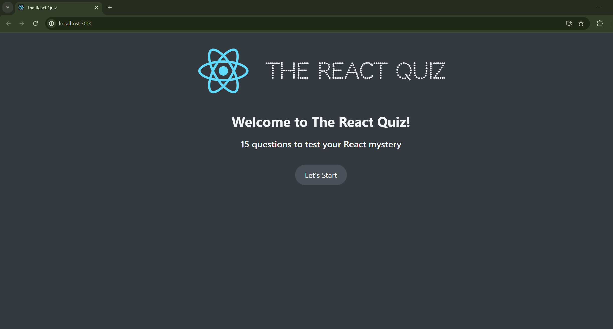
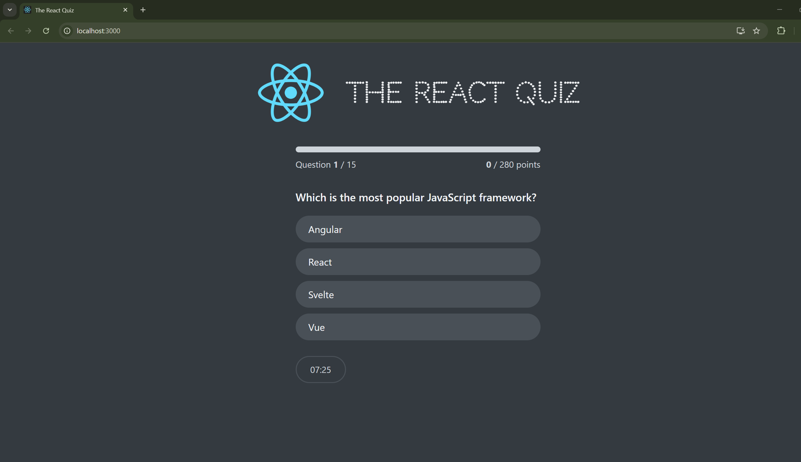

# React Quiz App

What is better that learning React while learning React? I was studying how to use useReducer instead of useState to create an interactive quiz to help me study React questions. 
Here's how the initial page looks like: 

This is the quiz layout; with the question count, point count (questions are weighed differently based on difficuly level), and the timer

