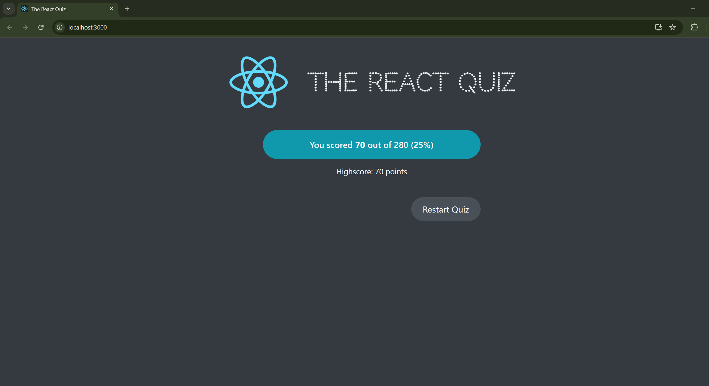
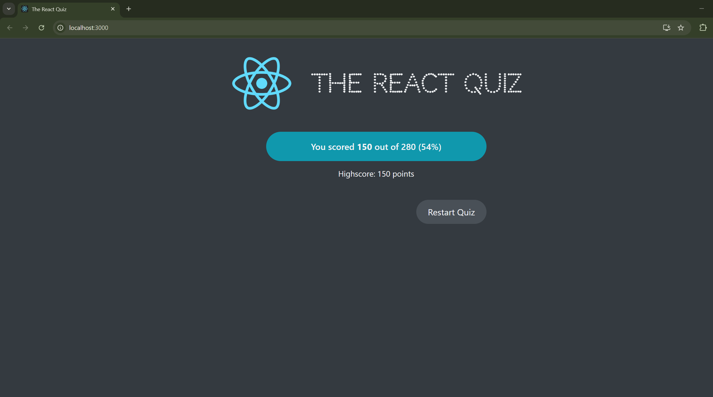

# React Quiz App

## Description:
What is better that learning React while learning React? I was studying how to use useReducer instead of useState to create an interactive quiz to help me study React questions. 
Here's how the initial page looks like: 

This is the quiz layout; with the question count, point count (questions are weighed differently based on difficuly level), and the timer

Because we chose the correct answer, number of points increased, and the correct answer was highlighted in blue, while all other questiosn are orange. When the user clicks on a choice, the "Next" button appears

When the user chooses an incorrect answer (clicked "Netflix", but the right answer is "Facebook"), the correct answer is still highlighted, and the number of points does not increase:

When we reach the final question, instead of the "Next" button "Finish" button appears

On the final page, user's results and highscore is displayed. If the user is not satisfied with the score, or simply wants to beat the previous highscore, he can retake the quiz again

Now, the user beat his previous highscore, so it gets reset:

## Directions:
In order for the project to run, clone it and open in Visual Studio Code. Open two terminals. In one, run "npm run server" and in the other "npm start". The former command launches the mock API from which our app pulls the questions
and the latter command runs the application itself.
