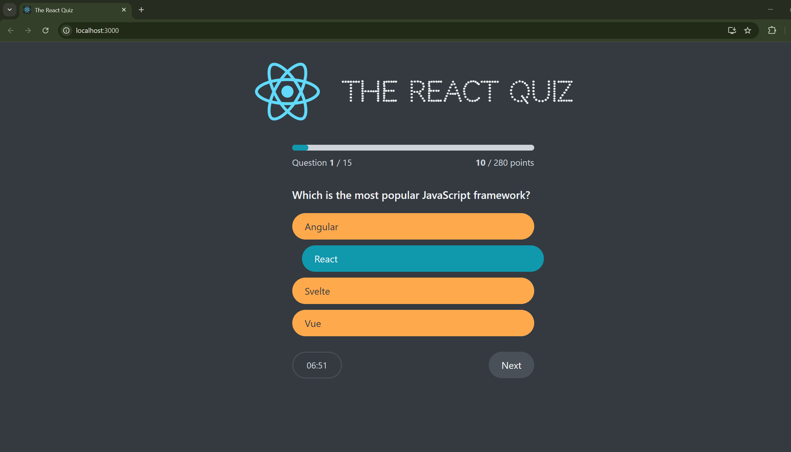
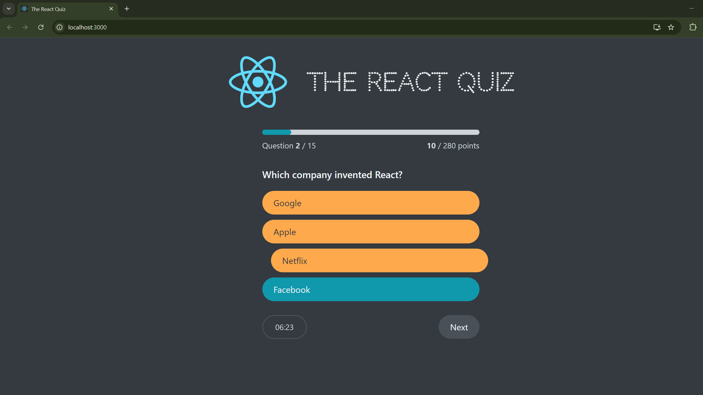
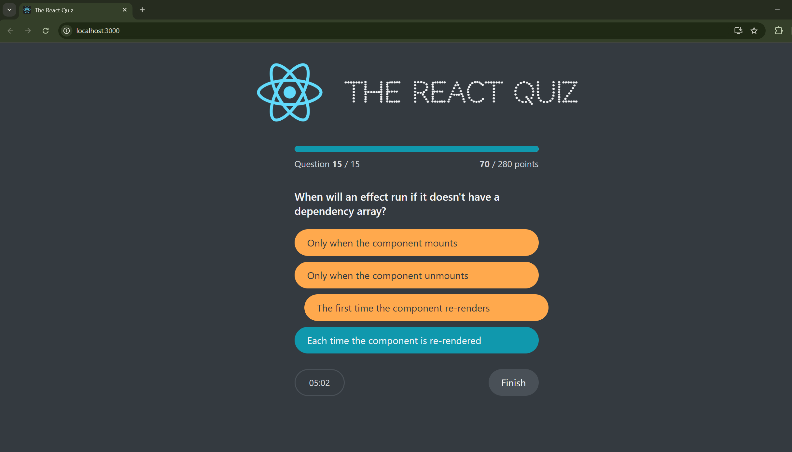

# React Quiz App

What is better that learning React while learning React? I was studying how to use useReducer instead of useState to create an interactive quiz to help me study React questions. 
Here's how the initial page looks like: 

This is the quiz layout; with the question count, point count (questions are weighed differently based on difficuly level), and the timer

Because we chose the correct answer, number of points increased, and the correct answer was highlighted in blue, while all other questiosn are orange. When the user clicks on a choice, the "Next" button appears

When the user chooses an incorrect answer (clicked "Netflix", but the right answer is "Facebook"), the correct answer is still highlighted, and the number of points does not increase:

When we reach the final question, instead of the "Next" button "Finish" button appears

